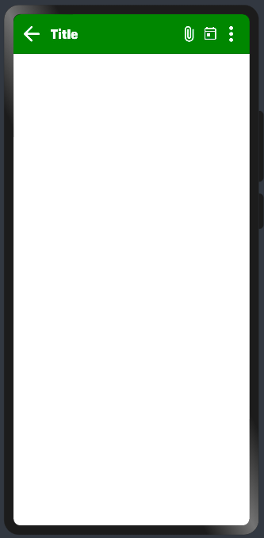

# Material AppBar

This library is developed to provide material app bar implemented using extended typescript.

## Installation

```npm install @ohos/material-appbar --save```

## Instructions for use

1. Import files and code dependencies

```
import { AppBar, NavigationIcon, Title, Headline, OptionMenu } from '@ohos/material-appbar'
```

2. Code for creating normal app bar

`Declaring models for creating app bar`

```
let model: AppBar.Model = new AppBar.Model()

let navigationIcon = new NavigationIcon.Model()
      .setIcon($r('app.media.back'))
      .setWidth('24vp').setHeight('24vp')
                        
let title = new Title.Model('Title')
      .setFontSize(20)
      .setFontColor(Color.White)
      .setTextAlign(TextAlign.Start)
      .setFontWeight(FontWeight.Normal)

let options = [
      new OptionMenu.Model(1, "Attach File").setIcon($r('app.media.attach')),
      new OptionMenu.Model(2, "Schedule").setIcon($r('app.media.schedule')),
      new OptionMenu.Model(3, "User Profile").setIcon($r('app.media.user'))
]

this.model
      .setNavigationIcon(navigationIcon)
      .setTitleModel(title)
      .setOptions(options)
      .setBackgroundColor(Color.Green)
      .addNavigationListener(() => {
            console.log('Navigation icon clicked')
      })
      .addOptionListener((option: OptionMenu.Model) => {
            console.log('Option:: ' + option.getLabel())
      })
```

`For creating AppBar with declared models`

``` 
AppBar({ model: this.model })
```



3. Code for creating app bar with center title

`Declaring models for creating app bar`

```
let model: AppBar.Model = new AppBar.Model()

let navigationIcon = new NavigationIcon.Model()
      .setIcon($r('app.media.menu'))
      .setWidth('24vp').setHeight('20vp')
                        
let title = new Title.Model('Title')
      .setFontSize(20)
      .setFontColor(Color.White)
      .setTextAlign(TextAlign.Center)
      .setFontWeight(FontWeight.Normal)

let options = [
      new OptionMenu.Model(1, "User Profile").setIcon($r('app.media.user'))
]

this.model
      .setNavigationIcon(navigationIcon)
      .setTitleModel(title)
      .setOptions(options)
      .setBackgroundColor(Color.Green)
      .addNavigationListener(() => {
            console.log('Navigation icon clicked')
      })
      .addOptionListener((option: OptionMenu.Model) => {
            console.log('Option:: ' + option.getLabel())
      })
```

`For creating AppBar with declared models`

``` 
AppBar({ model: this.model })
```


4. Code for creating app bar with headline

`Declaring models for creating app bar`

```
let model: AppBar.Model = new AppBar.Model()

let navigationIcon = new NavigationIcon.Model()
      .setIcon($r('app.media.back'))
      .setWidth('24vp').setHeight('24vp')
                        
let headline = new Headline.Model('Headline Title')
      .setFontSize(20)
      .setFontColor(Color.White)
      .setFontWeight(FontWeight.Normal)

let options = [
      new OptionMenu.Model(1, "Attach File").setIcon($r('app.media.attach')),
      new OptionMenu.Model(2, "Schedule").setIcon($r('app.media.schedule')),
      new OptionMenu.Model(3, "User Profile").setIcon($r('app.media.user'))
]

this.model
      .setNavigationIcon(navigationIcon)
      .setOptions(options)
      .setHeadlineModel(headline)
      .setBackgroundColor(Color.Green)
      .addNavigationListener(() => {
            console.log('Navigation icon clicked')
      })
      .addOptionListener((option: OptionMenu.Model) => {
            console.log('Option:: ' + option.getLabel())
      })
```

`For creating AppBar with declared models`

``` 
AppBar({ model: this.model })
```


5. Code for creating app bar with title & headline

`Declaring models for creating app bar`

```
let model: AppBar.Model = new AppBar.Model()

let navigationIcon = new NavigationIcon.Model()
      .setIcon($r('app.media.back'))
      .setWidth('24vp').setHeight('24vp')

let title = new Title.Model('Title')
      .setFontSize(20)
      .setFontColor(Color.White)
      .setTextAlign(TextAlign.Start)
      .setFontWeight(FontWeight.Normal)

let headline = new Headline.Model('Headline Title')
      .setFontSize(20)
      .setFontColor(Color.White)
      .setFontWeight(FontWeight.Normal)

let options = [
      new OptionMenu.Model(1, "Attach File").setIcon($r('app.media.attach')),
      new OptionMenu.Model(2, "Schedule").setIcon($r('app.media.schedule')),
      new OptionMenu.Model(3, "User Profile").setIcon($r('app.media.user'))
]

this.model
      .setNavigationIcon(navigationIcon)
      .setTitleModel(title)
      .setOptions(options)
      .setHeadlineModel(headline)
      .setBackgroundColor(Color.Green)
      .addNavigationListener(() => {
            console.log('Navigation icon clicked')
      })
      .addOptionListener((option: OptionMenu.Model) => {
            console.log('Option:: ' + option.getLabel())
      })
```

`For creating AppBar with declared models`

``` 
AppBar({ model: this.model })
```


## Interface description (AppBar.Model)

`let model: AppBar.Model = new AppBar.Model()`

1. Set navigation icon `model.setNavigationIcon()`
2. Set title `model.setTitleModel()`
3. Set options `model.setOptions()`
4. Set headline `model.setHeadlineModel()`
5. Set app bar background color `model.setBackgroundColor()`
6. Set callback function for navigation icon click `model.addNavigationListener()`
7. Set callback function for option click `model.addOptionListener()`

## Interface description (NavigationIcon.Model)

`let navigationIcon = new NavigationIcon.Model()`

1. Set icon `model.setIcon()`
2. Set width `model.setWidth()`
3. Set height `model.setHeight()`

## Interface description (Title.Model)

`let title = new Title.Model('Title')`

1. Set title `new Title.Model('Title')`
2. Set font size `model.setFontSize()`
3. Set font color `model.setFontColor()`
4. Set font weight `model.setFontWeight()`
5. Set text alignment `model.setTextAlign()`

## Interface description (Headline.Model)

`let headline = new Headline.Model('Headline Title')`

1. Set title `new Headline.Model('Headline Title')`
2. Set font size `model.setFontSize()`
3. Set font color `model.setFontColor()`
4. Set font weight `model.setFontWeight()`

## Interface description (OptionMenu.Model)

`let optionMenu = new OptionMenu.Model(1, "Option Menu")`

1. Set id & label `new OptionMenu.Model(1, "Option Menu")`
2. Set icon `model.setIcon()`
3. Set width `model.setWidth()`
4. Set height `model.setHeight()`

## Compatibility

Supports OpenHarmony API version 9

## Code Contribution

If you find any problems during usage, you can submit
an [Issue](https://github.com/Applib-OpenHarmony/MaterialAppBarTop/issues) to us. Of course, we also welcome you to send
us [PR](https://github.com/Applib-OpenHarmony/MaterialAppBarTop/pulls).

## Open source License

This project is based on [Apache License 2.0](https://github.com/Applib-OpenHarmony/MaterialAppBarTop/blob/main/LICENSE),
please enjoy and participate in open source freely.

# Reference:

Design by : Himanshu Piplani